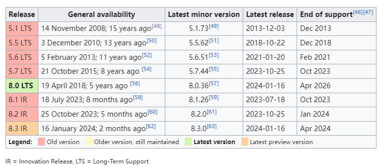
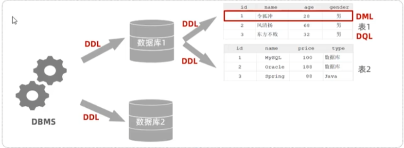

## 概念

SQL(Structured Query Language)

### 历史

### 关系型数据库

关系型数据库（RDBMS）是建立在关系模型基础上，由多张相互连接的二维表组成的数据库。

### SQL

什么是SQL？SQL是结构化查询语言的缩写，用来访问和操作数据库系统。SQL语句既可以查询数据库中的数据，也可以添加、更新和删除数据库中的数据，还可以对数据库进行管理和维护操作。

> 虽然SQL已经被ANSI组织定义为标准，不幸地是，各个不同的数据库对标准的SQL支持不太一致。并且，大部分数据库都在标准的SQL上做了扩展。也就是说，如果只使用标准SQL，理论上所有数据库都可以支持，但如果使用某个特定数据库的扩展SQL，换一个数据库就不能执行了。例如，Oracle把自己扩展的SQL称为PL/SQL，Microsoft把自己扩展的SQL称为T-SQL。
> 
> 现实情况是，如果我们只使用标准SQL的核心功能，那么所有数据库通常都可以执行。不常用的SQL功能，不同的数据库支持的程度都不一样。而各个数据库支持的各自扩展的功能，通常我们把它们称之为“方言”。

总的来说，SQL语言定义了这么几种操作数据库的能力：

| 分类 | 全称 | 说明 |
| --- | --- | --- |
| DDL | Data Definition Language   | 允许用户定义数据，也就是创建表、删除表、修改表结构这些操作 |
| DML | Data Manipulation Language | 允许用户添加、删除、更新数据 |
| DQL | Data Query Language        | 允许用户查询数据 |
| DCL | Data Control Language      | 用来创建数据库用户、控制数据库访问权限 |

